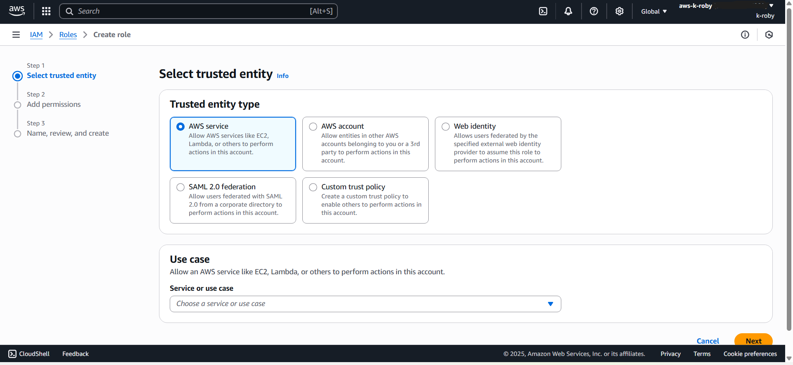
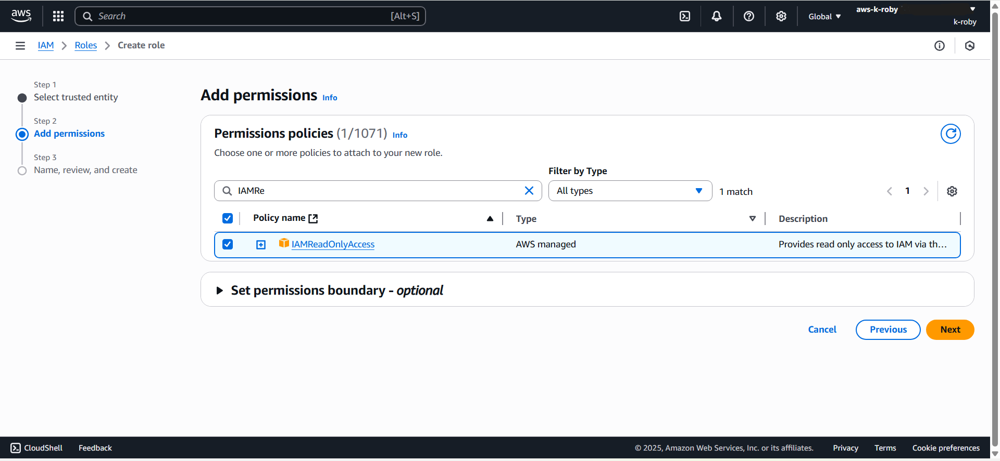
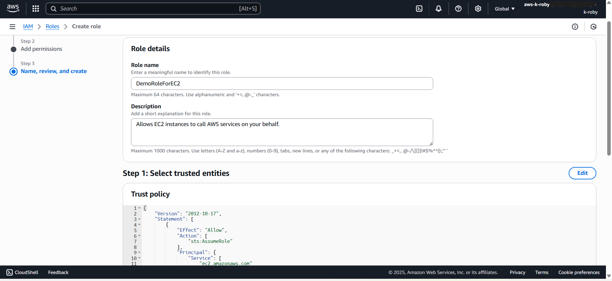

# AWS IAM — Creating an EC2 Service Role

## Objective

Create an IAM service role that allows EC2 instances to securely interact with AWS services using temporary credentials.

---

## Background

IAM service roles enable AWS services to assume a role and perform actions on your behalf.

This project demonstrates:

- Selecting a trusted entity
- Defining an EC2 service role
- Attaching managed policies
- Verifying successful role creation

Using service roles follows AWS security best practices by:
- Avoiding hardcoded credentials
- Leveraging temporary STS credentials
- Enforcing least privilege access

---

## Configuration Steps

### Step 1 — Select Trusted Entity

Trusted entity type selected:

- **AWS service**
- Service: **EC2**

---

### Step 2 — Choose Use Case

Selected:

- **EC2 use case**

---

### Step 3 — Attach Permissions Policy

Attached AWS managed policy:

- **IAMReadOnlyAccess**

---

### Step 4 — Name, Review, and Create

Role Name:

- `DemoRoleForEC2`

Trust policy configured for:

- `ec2.amazonaws.com`

---

### Step 5 — Verify Role Creation

Confirmed successful role creation in IAM → Roles.

---

## Security Impact

This configuration:

- Uses temporary credentials via AWS STS
- Eliminates embedded access keys
- Follows least privilege principles
- Enables secure service-to-service authentication

---

## Next Steps

- Attach role to an EC2 instance
- Replace IAMReadOnlyAccess with a custom least-privilege policy
- Enable CloudTrail to monitor role usage
