# Secure AWS Lambda Deployment & Configuration

## Project Overview

This project demonstrates the secure deployment, configuration, testing, and monitoring of an AWS Lambda function using Python 3.12.

The objective was to:

- Deploy a serverless function
- Configure an IAM execution role
- Invoke and validate function behavior
- Monitor runtime performance
- Inspect CloudWatch logs
- Review configuration and permissions

This project emphasizes secure serverless architecture fundamentals and operational visibility.

---

## Architecture Details

- **Service:** AWS Lambda  
- **Runtime:** Python 3.12  
- **Architecture:** x86_64  
- **Execution Role:** IAM role with basic Lambda permissions  
- **Monitoring & Logging:** Amazon CloudWatch  

---

## Step 1 – Navigate to AWS Lambda Console

Accessed the AWS Management Console and selected the Lambda service to begin creating a new serverless function.


---

## Step 2 – Create Lambda Function

Selected **Use a blueprint**, chose the Python 3.12 runtime, and assigned the function name `HelloWorld`.

This defines the runtime environment and identity of the function.

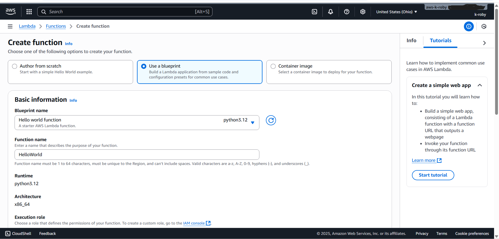

---

## Step 3 – Configure Execution Role

Created a new IAM execution role with basic Lambda permissions.

The execution role allows the function to write logs to Amazon CloudWatch. Using a dedicated IAM role enforces separation of permissions and follows the principle of least privilege.

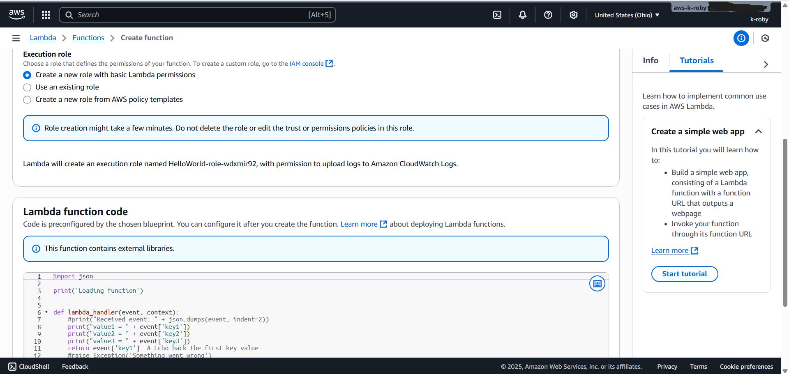

---

## Step 4 – Review Lambda Function Code

Reviewed the preconfigured Lambda function code prior to deployment.

```python
import json

print('Loading function')

def lambda_handler(event, context):
    print("value1 = " + event['key1'])
    print("value2 = " + event['key2'])
    print("value3 = " + event['key3'])
    return event['key1']
```

This function:

- Accepts structured JSON input
- Logs values to CloudWatch
- Returns a value from the input event

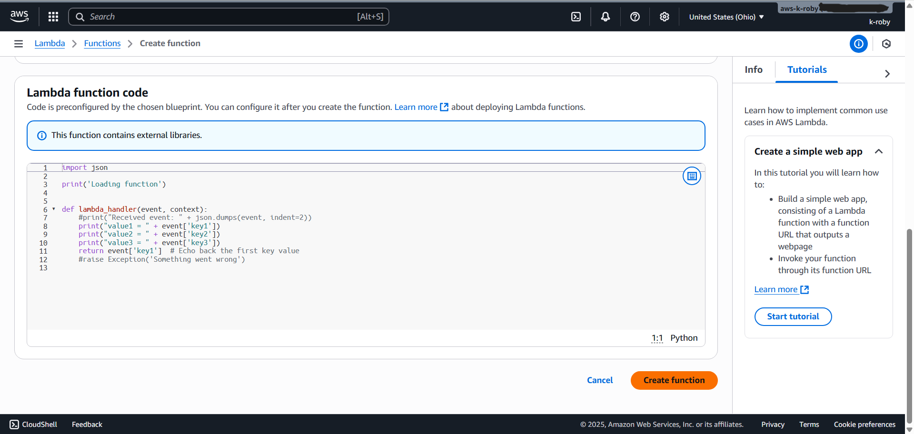

---

## Step 5 – Invoke Function with Test Event

Created a structured JSON test event to simulate input data and validate function behavior.

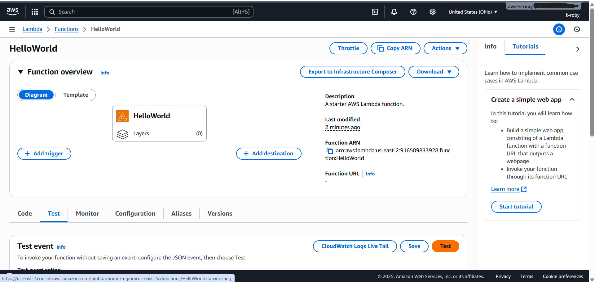

---

## Step 6 – Confirm Successful Execution

Executed the test event and confirmed the function ran successfully with no errors.

This verifies proper deployment and correct IAM role configuration.

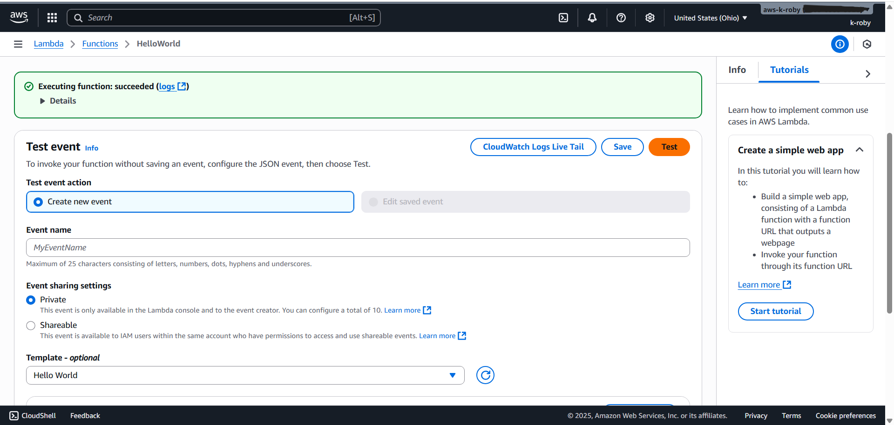

---

## Step 7 – Save Test Event

Named and saved the test event (`HelloWorldEvent`) to allow repeatable validation and consistent testing.

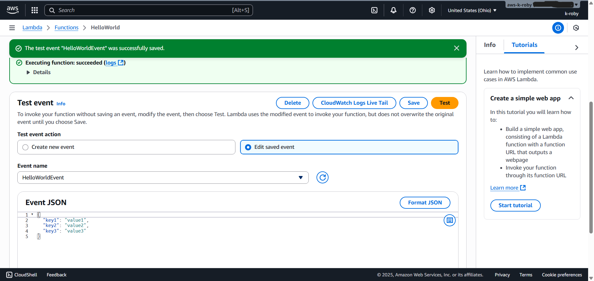

---

## Step 8 – Monitor via CloudWatch Metrics

Accessed the **Monitor** tab to review:

- Invocation count  
- Execution duration  
- Success rate  
- Error count  

Monitoring metrics ensures operational visibility and early detection of issues.

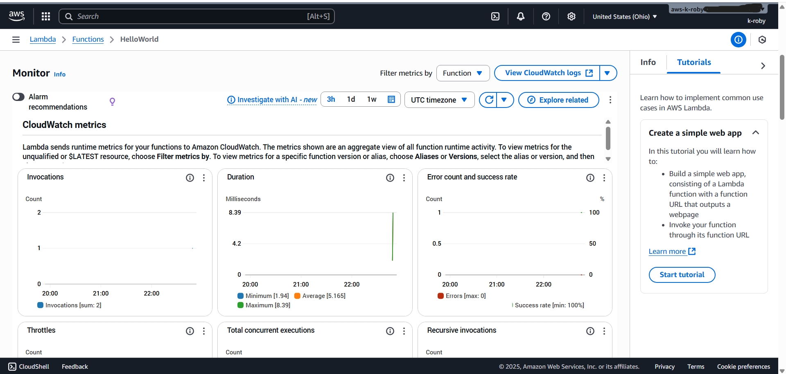

---

## Step 9 – Navigate to CloudWatch Log Groups

Accessed the automatically generated log group:

`/aws/lambda/HelloWorld`

AWS Lambda integrates directly with CloudWatch for centralized logging.

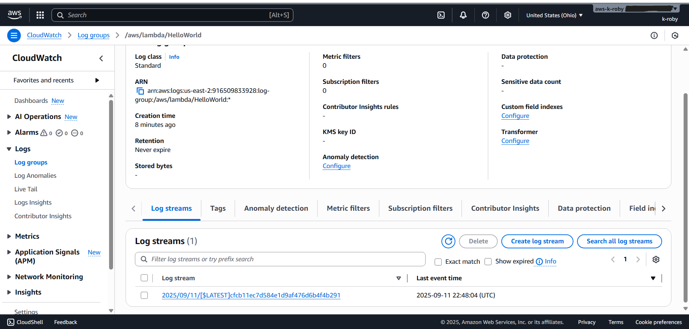

---

## Step 10 – Inspect Log Stream

Opened the most recent log stream to review:

- Timestamps  
- Request IDs  
- Execution duration  
- Memory usage  
- Logged event values  

This confirms the function processed the JSON event correctly and executed within expected resource limits.

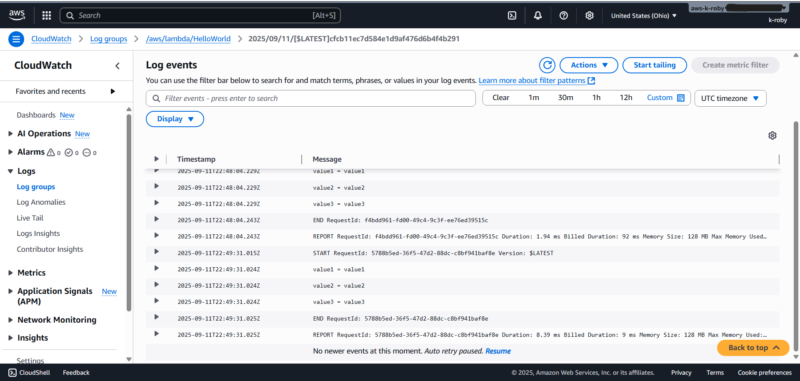

---

## Step 11 – Review Configuration Settings

Navigated to **Configuration → Basic Settings** to verify:

- Memory allocation (128 MB)
- Timeout (3 seconds)
- Ephemeral storage
- Execution role permissions
- Trigger configuration

Configuration validation ensures appropriate resource allocation and security alignment.

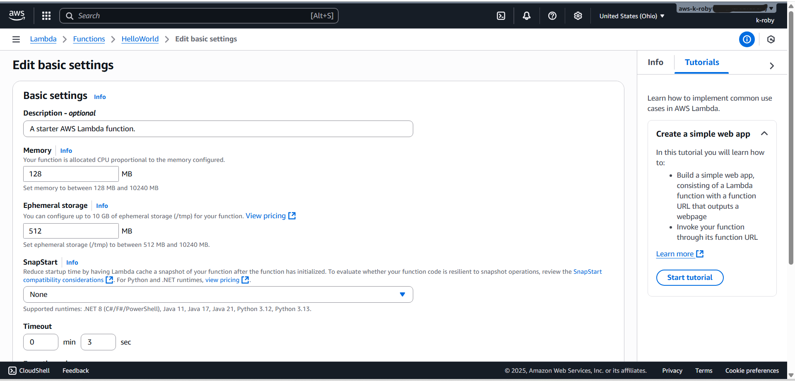

---

## Step 12 – Final Deployment Confirmation

Returned to the Lambda dashboard to confirm:

- Function successfully created  
- Runtime properly configured  
- Execution role attached  
- Deployment status healthy  

This validates successful secure deployment.

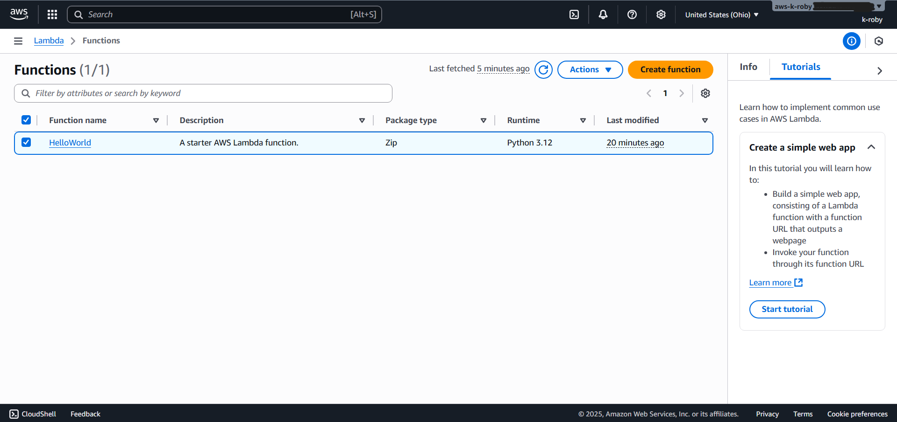

---

## Security Considerations

This project demonstrates foundational serverless security practices:

- IAM execution role enforcement  
- Principle of least privilege  
- CloudWatch logging integration  
- Runtime monitoring  
- Error tracking and validation  
- Configuration verification  

In a production environment, further hardening would include:

- Custom IAM policies with restricted permissions  
- Log retention configuration  
- CloudWatch alarms  
- AWS X-Ray tracing  
- Encrypted environment variables  
- API Gateway authentication and authorization  

---

## Skills Demonstrated

- AWS Lambda deployment  
- IAM role configuration  
- JSON event handling  
- CloudWatch monitoring  
- Log inspection and troubleshooting  
- Serverless architecture fundamentals  
- Security-aware cloud configuration  
